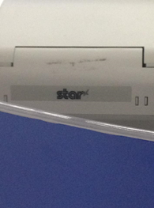
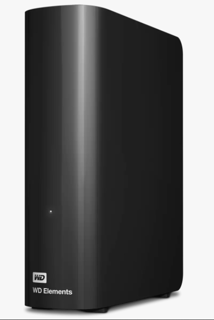

> Two projects I had in industry when I was working for Kcodes Corporation.

### Star Micronics Thermal POS Printers

We designed and implemented the software for Star Micronics thermal printers.

### Western Digital SMB Implementation

SMB/Samba is a network file sharing protocol.
